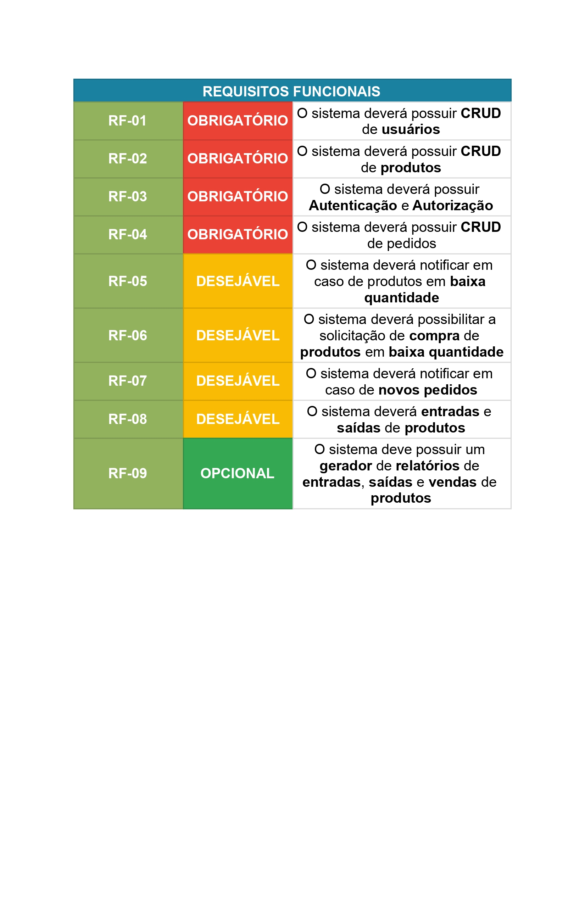

# Especificações do Projeto

O projeto visa desenvolver um sistema de gestão abrangente para distribuidoras de Gás Liquefeito de Petróleo (GLP), com foco na otimização de processos e análise de dados. O sistema será composto por versões mobile e web, permitindo acesso simultâneo por meio de diversos dispositivos. As principais funcionalidades incluem:

### Extrato Mensal e Controle de Insumos:
   * Geração de extrato mensal de quantidade inicial de insumos.
   * Acompanhamento do estoque de GLP.
   
## Controle de Empréstimos de Botijões:
   * Registro e rastreamento de empréstimos de botijões.
   
## Carteira de Contato de Clientes:
   * Armazenamento centralizado de informações de contato dos clientes.
   
## Análise de Dados:
   * Análise dos dados armazenados para identificar tendências e oportunidades.
   * Previsões de demanda e estratégias com base nas métricas de vendas, custos, etc.
   
## Autenticação e Controle de Usuários:
   * Sistema de autenticação seguro.
   * Controle de permissões de acordo com as funções dos usuários.

# Personas

 ## Ana, Gerente Administrativa:
   * Responsável pelo controle de estoque e emissão de relatórios mensais de insumos.
   * Valoriza a praticidade e organização para agilizar suas tarefas diárias.

## Carlos, Analista Financeiro:
   * Encarregado de monitorar os custos e receitas da distribuidora.
   * Precisa de dados precisos para elaborar projeções financeiras.

## Renata, Coordenadora de RH:
   * Lida com informações dos funcionários, como escalas e benefícios.
   * Valoriza a segurança dos dados e a facilidade de acesso às informações da equipe.

## Luís, Gerente Comercial:
   * Concentra-se em estratégias de vendas e relacionamento com clientes.
   * Necessita de dados sobre clientes e análises para tomar decisões informadas.

## Mariana, Supervisora Operacional:
   * Responsável pela logística e produção.
   * Requer um sistema para gerenciar empréstimos de botijões e acompanhar o fluxo de trabalho.

O sistema atende às necessidades de cada persona, oferecendo uma plataforma unificada para melhorar a eficiência e tomada de decisões na distribuidora de gás, promovendo uma gestão mais eficaz e otimizada.

## Histórias de Usuários

Com base na análise das personas foram identificadas as seguintes histórias de usuários:

| Persona: Ana, Gerente Administrativa | |
| ------------------------------------ | --------------------------- |
| **Desafio Anterior**                | Ana gastava muito tempo verificando manualmente o estoque de botijões de gás e preparando relatórios mensais de insumos. Isso atrasava suas tarefas diárias e causava frustração. |
| **Solução com o Sistema**           | Com o novo sistema de gestão, Ana pode acessar o status do estoque em tempo real e os relatórios são gerados automaticamente. Isso economiza seu tempo e permite que ela se concentre em atividades estratégicas. |
| **Benefícios**                      | Economia de tempo, relatórios precisos, maior eficiência nas tarefas diárias. |

| Persona: Carlos, Analista Financeiro |  |
| ------------------------------------ | ------------------------------ |
| **Desafio Anterior**                | Carlos enfrentava dificuldades devido a dados desatualizados e imprecisos para suas análises financeiras. Suas projeções financeiras eram afetadas negativamente. |
| **Solução com o Sistema**           | Com o sistema de gestão, Carlos obtém acesso a informações financeiras atualizadas em tempo real. Isso permite análises mais precisas e projeções financeiras embasadas. |
| **Benefícios**                      | Análises financeiras precisas, projeções estratégicas, tomada de decisões informada. |

| Persona: Renata, Coordenadora de RH  |  |
| ------------------------------------ | ------------------------------ |
| **Desafio Anterior**                | Renata tinha dificuldades em manter as informações dos funcionários organizadas e acessíveis, o que prejudicava a elaboração de escalas e a concessão de benefícios. |
| **Solução com o Sistema**           | Com o sistema de gestão, Renata pode gerenciar de forma eficiente os dados dos funcionários, elaborar escalas com mais facilidade e garantir a correta concessão de benefícios. |
| **Benefícios**                      | Gestão eficaz de recursos humanos, escalas bem organizadas, processamento preciso de benefícios. |

| Persona: Luís, Gerente Comercial      |  |
| ------------------------------------  | ---------------------------- |
| **Desafio Anterior**                | Luís enfrentava dificuldades para identificar oportunidades de vendas e compreender as necessidades dos clientes devido à falta de informações detalhadas. |
| **Solução com o Sistema**           | Com o sistema de gestão, Luís pode acessar o histórico de compras dos clientes, identificar padrões de compra e planejar abordagens personalizadas, resultando em decisões de vendas mais informadas. |
| **Benefícios**                      | Identificação de oportunidades de vendas, relacionamento com clientes aprimorado, estratégias embasadas. |

| Persona: Mariana, Supervisora Operacional |  |
| ----------------------------------------  | ------------------------------- |
| **Desafio Anterior**                   | Mariana enfrentava dificuldades na gestão manual de empréstimos de botijões e na supervisão da logística de produção, o que causava atrasos e problemas no fluxo de trabalho. |
| **Solução com o Sistema**              | Com o sistema de gestão, Mariana pode rastrear empréstimos de botijões, monitorar a logística e otimizar o processo de produção, resultando em uma gestão mais eficiente e fluxo de trabalho suave. |
| **Benefícios**                         | Gestão otimizada de empréstimos, logística eficiente, produção sem problemas. |

## Modelagem do Processo de Negócio 

### Análise da Situação Atual

Apresente aqui os problemas existentes que viabilizam sua proposta. Apresente o modelo do sistema como ele funciona hoje. Caso sua proposta seja inovadora e não existam processos claramente definidos, apresente como as tarefas que o seu sistema pretende implementar são executadas atualmente, mesmo que não se utilize tecnologia computacional. 

### Descrição Geral da Proposta

Apresente aqui uma descrição da sua proposta abordando seus limites e suas ligações com as estratégias e objetivos do negócio. Apresente aqui as oportunidades de melhorias.

### Processo 1 – NOME DO PROCESSO

Apresente aqui o nome e as oportunidades de melhorias para o processo 1. Em seguida, apresente o modelo do processo 1, descrito no padrão BPMN. 

### Processo 2 – NOME DO PROCESSO

Apresente aqui o nome e as oportunidades de melhorias para o processo 2. Em seguida, apresente o modelo do processo 2, descrito no padrão BPMN.

## Indicadores de Desempenho

Apresente aqui os principais indicadores de desempenho e algumas metas para o processo. Atenção: as informações necessárias para gerar os indicadores devem estar contempladas no diagrama de classe. Colocar no mínimo 5 indicadores. 

Usar o seguinte modelo: 

Obs.: todas as informações para gerar os indicadores devem estar no diagrama de classe a ser apresentado a posteriori. 

## Requisitos

As tabelas que se seguem apresentam os requisitos funcionais e não funcionais que detalham o escopo do projeto. Para determinar a prioridade de requisitos, aplicar uma técnica de priorização de requisitos e detalhar como a técnica foi aplicada.

### Requisitos Funcionais

### Requisitos não Funcionais

Com base nas Histórias de Usuário, enumere os requisitos da sua solução. Classifique esses requisitos em dois grupos:

- [Requisitos Funcionais
 (RF)](https://pt.wikipedia.org/wiki/Requisito_funcional):
 correspondem a uma funcionalidade que deve estar presente na
  plataforma (ex: cadastro de usuário).
- [Requisitos Não Funcionais
  (RNF)](https://pt.wikipedia.org/wiki/Requisito_n%C3%A3o_funcional):
  correspondem a uma característica técnica, seja de usabilidade,
  desempenho, confiabilidade, segurança ou outro (ex: suporte a
  dispositivos iOS e Android).
Lembre-se que cada requisito deve corresponder à uma e somente uma
característica alvo da sua solução. Além disso, certifique-se de que
todos os aspectos capturados nas Histórias de Usuário foram cobertos.

## Restrições

O projeto está restrito pelos itens apresentados na tabela a seguir.

|ID| Restrição                                             |
|--|-------------------------------------------------------|
|01| O projeto deverá ser entregue até o final do semestre |
|02| Não pode ser desenvolvido um módulo de backend        |

Enumere as restrições à sua solução. Lembre-se de que as restrições geralmente limitam a solução candidata.

> **Links Úteis**:
> - [O que são Requisitos Funcionais e Requisitos Não Funcionais?](https://codificar.com.br/requisitos-funcionais-nao-funcionais/)
> - [O que são requisitos funcionais e requisitos não funcionais?](https://analisederequisitos.com.br/requisitos-funcionais-e-requisitos-nao-funcionais-o-que-sao/)

## Diagrama de Casos de Uso

# Matriz de Rastreabilidade

A matriz de rastreabilidade é uma ferramenta usada para facilitar a visualização dos relacionamento entre requisitos e outros artefatos ou objetos, permitindo a rastreabilidade entre os requisitos e os objetivos de negócio. 

A matriz deve contemplar todos os elementos relevantes que fazem parte do sistema, conforme a figura meramente ilustrativa apresentada a seguir.

> **Links Úteis**:
> - [Artigo Engenharia de Software 13 - Rastreabilidade](https://www.devmedia.com.br/artigo-engenharia-de-software-13-rastreabilidade/12822/)
> - [Verificação da rastreabilidade de requisitos usando a integração do IBM Rational RequisitePro e do IBM ClearQuest Test Manager](https://developer.ibm.com/br/tutorials/requirementstraceabilityverificationusingrrpandcctm/)
> - [IBM Engineering Lifecycle Optimization – Publishing](https://www.ibm.com/br-pt/products/engineering-lifecycle-optimization/publishing/)

# Gerenciamento de Projeto

De acordo com o PMBoK v6 as dez áreas que constituem os pilares para gerenciar projetos, e que caracterizam a multidisciplinaridade envolvida, são: Integração, Escopo, Cronograma (Tempo), Custos, Qualidade, Recursos, Comunicações, Riscos, Aquisições, Partes Interessadas. Para desenvolver projetos um profissional deve se preocupar em gerenciar todas essas dez áreas. Elas se complementam e se relacionam, de tal forma que não se deve apenas examinar uma área de forma estanque. É preciso considerar, por exemplo, que as áreas de Escopo, Cronograma e Custos estão muito relacionadas. Assim, se eu amplio o escopo de um projeto eu posso afetar seu cronograma e seus custos.

## Gerenciamento de Tempo

## INTRODUÇÃO

No Brasil a maioria das pessoas recebem o gás de cozinha por meio caminhões, ou entregadores de moto, ou indo até os revendedores e buscando, utilizando os chamados botijão de gás. Proporcionalmente são poucas pessoas que recebem o gás canalizado onde se é pago mensalidades para o uso deste serviço, onde o grosso deste serviço está localizado nas cidades mais populosas e mesmo assim restrito para a maioria da população.

Para esta maioria de consumidores no país foi necessário pensar uma forma de ajudar estes consumidores e seus respectivos revendedores. Um sistema/aplicativo que ajudará em seu controle de estoque, para um melhor gerenciamento seja no recebimento de seu distribuidor, seja para o atendimento a seu cliente final.

## Gerenciamento do Projeto

A equipe utiliza metodologias ágeis, tendo escolhido o Scrum como base para definição do processo de desenvolvimento.

A equipe está organizada da seguinte maneira:
-	Scrum Master: Ryan Camargos
-	Product Owner: Marcos Vidal
-	Equipe de Desenvolvimento
-	Gilvimar Vieira
-	Lucas Andrade
-	Marcos Vidal
-	Rafael Gonçalves
-	Ryan Camargos
-	Equipe de Design
-	Rafael Gonçalves, 
-	Equipe de Testes
-	Gilvimar Vieira (Web), Lucas Andrade (Mobile).

Para organização e distribuição das tarefas do projeto, a equipe está utilizando o Trello e o GitHub além do Project Libre para o gerenciamento das etapas elaboradas deste processo, além de permanentes conversas pelo WatsAPP, Microsoft Tems e o Discord para poder agilizar o processo de conversas e alinhamentos da aplicação.

## Gerenciamento de Cronograma 

Gerenciamento de Cronograma se dá pelo conjunto de processos necessários que serve para garantir que o projeto seja entregue no prazo estipulado. Afinal, o cronograma traz uma visão geral das atividades e das relações entre elas, além de mostrar os prazos das atividades que compõe as atividades do processo de criação da aplicação.

De acordo com a 6ª edição do PMBOK®, guia de boas práticas em gestão de projetos, o gerenciamento de cronograma é formado por seis processos: 
- planejar o gerenciamento do cronograma,
- definir as atividades,
- sequenciar as atividades,
- estimar as durações das atividades,
- desenvolver o cronograma,
- controlar o cronograma. 

> ## **Cronograma do projeto**:
> ### [Cronograma do projeto](../docs/pdfs/cronograma-projeto.pdf)

> ## **Burnup**:
> ### [Burnup](../docs/pdfs/burnup.pdf)

Mostrando que o primeiro mês (agosto) será destinado para a realização do planejamento para as execuções. O segundo mês (setembro) destina-se para a execução do Desenvolvimento do Back-end: Web API. O terceiro mês  (outubro) realiza-se o Desenvolvimento do Front-end: Web. O Quarto mês (novembro) destina-se ao Desenvolvimento do Front-end: Mobile. 
E na primeira semana de dezembro a entrega final de toda a aplicação.
Sendo que ao final de cada etapa será realizado testes no processo de desenvolvimento, ao qual estes testes são realizados na última semana de cada mês. 
A cada semana será realizada uma reunião da equipe onde será para alinhamento de cada etapa do processo, onde ocorreram erros se houver durante o processo

## Gerenciamento de Custos em Projetos
Gerenciamento de Custos em Projetos é um conjunto de processos que tem por objetivo garantir que o projeto seja entregue dentro do orçamento aprovado, onde possa ser gerenciado o recurso financeiro em cada etapa do processo para que não falte o recurso para execução da aplicação em todo o seu processo do inicio até a sua conclusão. 

A falta de gerenciamento de recursos pode atrapalhar muito o desempenho do projeto da aplicação. Recursos inadequados podem muitas vezes comprometer o prazo de entrega, e por consequência a sua qualidade, além do orçamento destinado ao projeto. 

Desta forma, é uma necessidade um bom gerenciamento de recursos para que o conjunto de processos possa identificar, adquirir e gerenciar os recursos do projeto, para que seja entregue com sucesso.   
Sendo definido os recursos em duas partes: 
- Os recursos de equipe são os recursos humanos, ou seja, as pessoas que prestam serviços ao projeto. Para isso, é importante que a equipe seja integrada, bem-informada;
- Os recursos físicos são os materiais, suprimentos, instalações e equipamentos necessários para a execução de um projeto. Para isso, é importante que o gerente de projetos tenha conhecimento das demandas e quantidades dos materiais utilizados.

Durante este processo pretende utilizar linguagens de programação gratuitas como React e React Native, JavaScript, PHP entre outras. Para o acompanhamento de Versionamento utilizar o Git e o GitHUB, Para o Leitor de códigos o VSCode Banco de dados MySQL. Além dos computadores pessoais, cadeiras, mesas, o custo de mobiliário não será computado para este projeto, energia elétrica e custo de internet de cada membro da equipe.

Terá o custo mensal estimado de energia elétrica e Internet `R$ 100,00` internet e `R$ 0,00` Energia elétrica em um total mensal de `R$ 150,00` e total do Projeto de `R$ 750,00`.

Cada membro da equipe se dedicará 04 horas ao projeto pelo custo de `R$ 20,00` a hora trabalhada de segunda a sexta feira ao longo destes 5 meses de execução do projeto. Sendo que em cada reunião realizada pela equipe este custo operacional pode ser revisado para cima ou para baixo devido as necessidades do projeto.

O custo mensal por cada integrante por hora trabalhada é estimado em `R$ 400,00` por semana, `R$ 1.600,00` mensal e total de `R$ 8.000,00` 

Custo Mensal total `R$ 1750,00`
Custo total execução de `R$ 8,750,00`