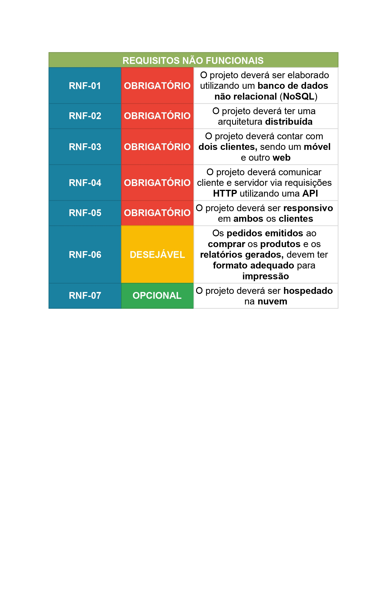
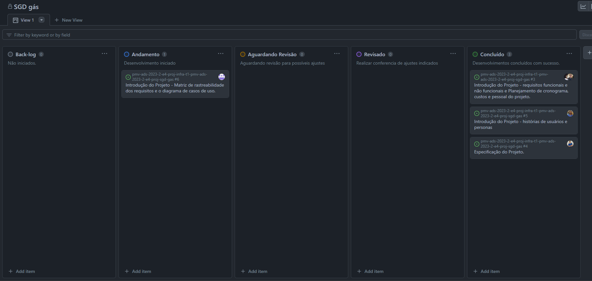
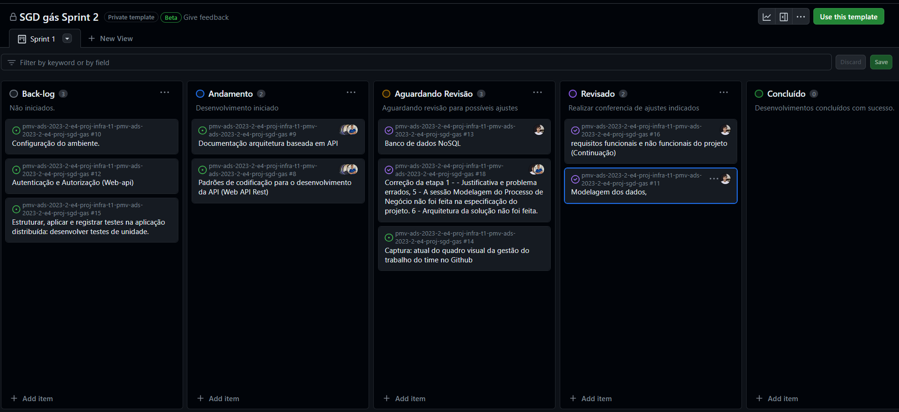
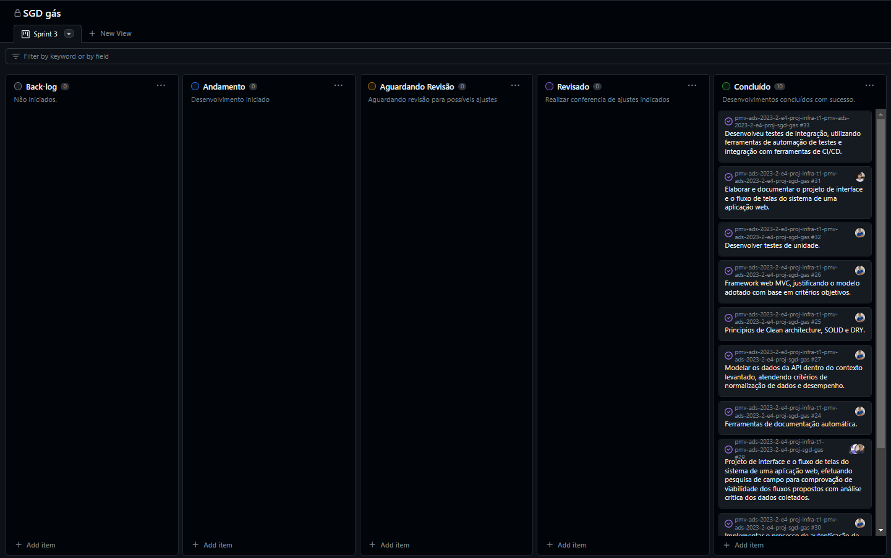
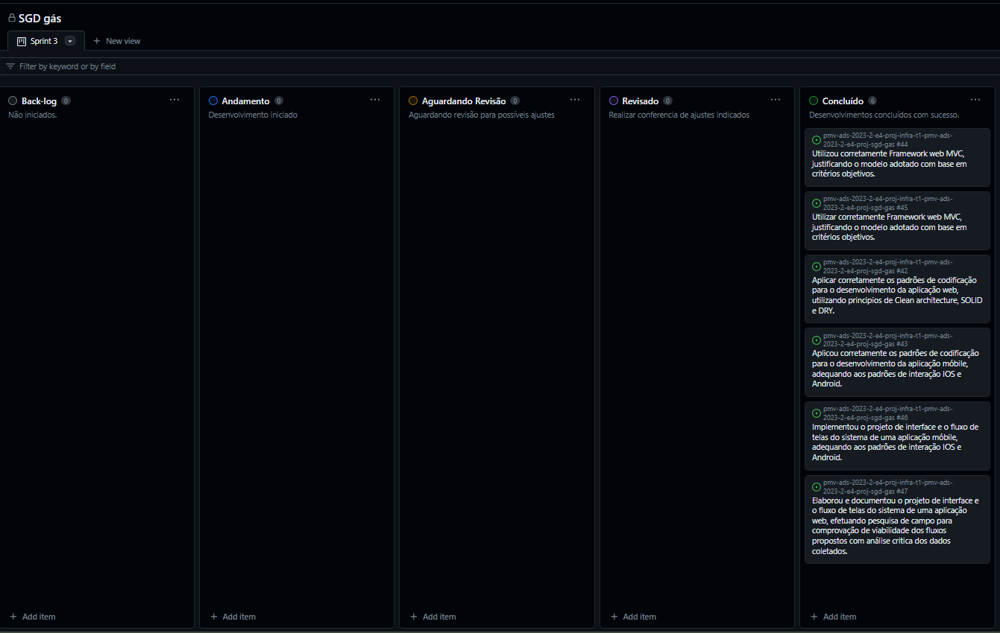
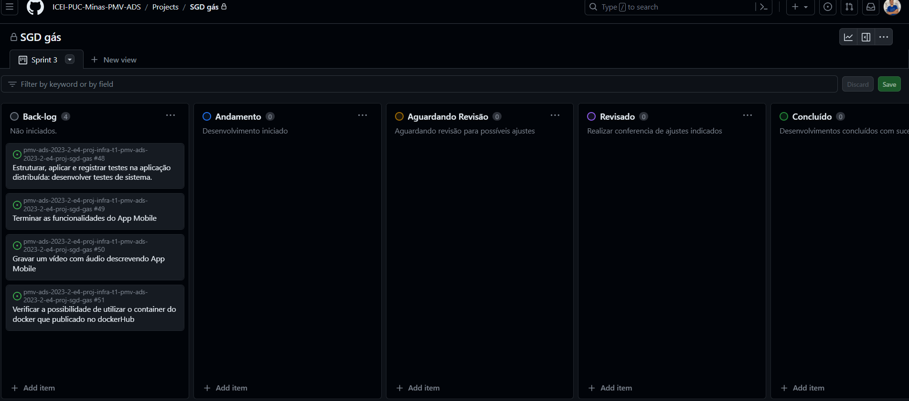

# Especificações do Projeto

## Visão Abrangente do Projeto:

A distribuição de Gás Liquefeito de Petróleo é um componente crítico da infraestrutura de energia em todo o mundo, fornecendo um suprimento essencial de combustível para residências, indústrias e comércios. No entanto, a gestão eficiente dessa cadeia de abastecimento pode ser um desafio complexo devido a vários fatores, incluindo demanda flutuante, regulamentações rigorosas e a necessidade de manter um estoque adequado. É nesse contexto que o projeto de desenvolvimento de um sistema de gestão completo e integrado para distribuidoras de GLP emerge como uma iniciativa de vanguarda.

## Objetivo Central:

O projeto visa principalmente criar um sistema de gestão altamente adaptável que atenda às necessidades específicas das distribuidoras de GLP. O foco principal é otimizar cada faceta das operações, desde o acompanhamento minucioso do estoque até o fortalecimento das relações com os clientes, passando por análises de dados estratégicas.

## Componentes Multifacetados do Sistema:

O sistema de gestão será composto por duas interfaces principais: uma versão móvel e uma versão web. A escolha de duas plataformas distintas objetiva oferecer flexibilidade e acessibilidade, garantindo que funcionários e clientes possam acessar informações cruciais de qualquer lugar e dispositivo.

## Funcionalidades Detalhadas:

   ### Extrato Mensal e Controle de Insumos:
   - Uma das funções essenciais do sistema é a geração de extratos mensais detalhados que apresentam a quantidade inicial de insumos de GLP disponíveis na distribuidora. Esta funcionalidade desempenha um papel 
        crítico na gestão de estoque, permitindo o monitoramento constante dos níveis de GLP em cada ponto de armazenamento.
   - Além disso, o sistema oferecerá ferramentas para acompanhar o estoque de GLP em tempo real, alertando proativamente os gestores sobre a necessidade de reabastecimento e, assim, prevenindo a escassez de produtos essenciais.

   ### Controle de Empréstimos de Botijões:
   - O controle eficaz dos empréstimos de botijões é outra funcionalidade vital que aprimorará as operações. Os funcionários terão a capacidade de registrar e rastrear empréstimos de botijões para clientes ou outras partes interessadas. Isso assegurará que os botijões sejam devidamente monitorados e devolvidos, reduzindo perdas e aumentando a transparência nas transações.

   ### Carteira de Contato de Clientes:
   - O sistema manterá um repositório centralizado de informações de contato dos clientes, que incluirá nomes, endereços, números de telefone e detalhes de contratos. Esta centralização permitirá um relacionamento mais eficiente e personalizado com os clientes, reforçando a fidelidade e a satisfação.

   ### Análise de Dados:
   - A análise de dados representa uma das facetas mais poderosas do sistema. Ele coletará dados abrangentes sobre todas as operações da distribuidora, incluindo vendas, custos, histórico de empréstimos e estoque. Esses dados serão submetidos a análises regulares por meio de algoritmos avançados, revelando tendências, oportunidades de aprimoramento e áreas de risco.
   - Adicionalmente, o sistema aplicará técnicas de previsão para estimar a demanda futura de GLP, capacitando a distribuidora a se preparar de forma proativa para atender às necessidades flutuantes do mercado.

   ### Autenticação e Controle de Usuários:
   - Para garantir a integridade dos dados e a segurança das informações confidenciais, o sistema será equipado com um sistema de autenticação robusto. Isso garantirá que apenas usuários autorizados tenham acesso às informações e funcionalidades do sistema.
   - O controle de permissões será implementado com precisão, permitindo que diferentes categorias de usuários tenham acesso a recursos específicos com base em suas funções na organização. Dessa forma, as informações críticas estarão resguardadas, e cada usuário acessará somente o que for relevante para suas tarefas.

## Benefícios e Impacto Abrangente:
Este projeto representa uma revolução na operação das distribuidoras de GLP, indo além da simples modernização da infraestrutura de TI. Os benefícios esperados são vastos e impactantes:

   - **Eficiência Operacional:** A automação e o monitoramento em tempo real aprimorarão significativamente a eficiência operacional, minimizando erros e retrabalho.

   - **Gestão de Estoque Eficiente:** O controle em tempo real do estoque garantirá que não haja interrupções na distribuição de GLP, assegurando que os clientes recebam seus produtos de maneira pontual.

   - **Tomada de Decisões Embasada em Dados:** A análise de dados permitirá que a alta administração tome decisões estratégicas fundamentadas, direcionando recursos de maneira mais precisa e eficaz.

   - **Experiência do Cliente Aprimorada:** A centralização das informações de contato dos clientes e o atendimento personalizado elevarão a experiência do cliente, aumentando a fidelidade e a satisfação.

   - **Transparência e Controle Aprimorados:** O controle meticuloso dos empréstimos de botijões proporcionará uma gestão mais eficaz dos ativos e maior transparência nas transações.

   - **Impacto Pioneiro no Setor e Além:**
Este projeto tem o potencial de transcender as fronteiras da distribuição de GLP e criar um impacto significativo em todo o setor e além dele.

   - **Referência para o Setor:** A implementação bem-sucedida deste sistema pode servir como um modelo inspirador para outras distribuidoras de GLP, incentivando a adoção de tecnologias de gestão avançadas e elevando o padrão do setor como um todo.

   - **Estabilidade de Preços para Consumidores:** As análises de dados e as previsões de demanda podem contribuir para a estabilização dos preços do GLP, garantindo que o produto esteja disponível a preços justos e acessíveis para os consumidores finais.

# Personas

| Persona              | Função                    | Responsabilidades                                   | Necessidades                          | Foto      |
|----------------------|---------------------------|-----------------------------------------------------|---------------------------------------|-----------|
| Ana                  | Gerente Administrativa    | Controle de estoque e emissão de relatórios mensais | Praticidade e organização          | 
| Carlos               | Analista Financeiro       | Monitorar custos e receitas, elaborar projeções     | Dados precisos                     ||
| Renata               | Coordenadora de RH        | Gerenciar informações de funcionários              | Segurança dos dados, fácil acesso   ||
| Luís                 | Gerente Comercial         | Estratégias de vendas e relacionamento com clientes| Dados sobre clientes, análises       ||
| Mariana              | Supervisora Operacional   | Logística, gestão de empréstimos, fluxo de trabalho | Sistema de gerenciamento eficaz     ||

O sistema atende às necessidades de cada persona, oferecendo uma plataforma unificada para melhorar a eficiência e tomada de decisões na distribuidora de gás, promovendo uma gestão mais eficaz e otimizada.

## Histórias de Usuários

| Persona: Ana, Gerente Administrativa | Problema |
| ------------------------------------ | --------------------------- |
| **Desafio Anterior**                | Ana gastava muito tempo verificando manualmente o estoque de botijões de gás e preparando relatórios mensais de insumos. Isso atrasava suas tarefas diárias e causava frustração. |
| **Solução com o Sistema**           | Com o novo sistema de gestão, Ana pode acessar o status do estoque em tempo real e os relatórios são gerados automaticamente. Isso economiza seu tempo e permite que ela se concentre em atividades estratégicas. |
| **Benefícios**                      | Economia de tempo, relatórios precisos, maior eficiência nas tarefas diárias. |

| Persona: Carlos, Analista Financeiro | Problema |
| ------------------------------------ | ------------------------------ |
| **Desafio Anterior**                | Carlos enfrentava dificuldades devido a dados desatualizados e imprecisos para suas análises financeiras. Suas projeções financeiras eram afetadas negativamente. |
| **Solução com o Sistema**           | Com o sistema de gestão, Carlos obtém acesso a informações financeiras atualizadas em tempo real. Isso permite análises mais precisas e projeções financeiras embasadas. |
| **Benefícios**                      | Análises financeiras precisas, projeções estratégicas, tomada de decisões informada. |

| Persona: Renata, Coordenadora de RH  | Problema |
| ------------------------------------ | ------------------------------ |
| **Desafio Anterior**                | Renata tinha dificuldades em manter as informações dos funcionários organizadas e acessíveis, o que prejudicava a elaboração de escalas e a concessão de benefícios. |
| **Solução com o Sistema**           | Com o sistema de gestão, Renata pode gerenciar de forma eficiente os dados dos funcionários, elaborar escalas com mais facilidade e garantir a correta concessão de benefícios. |
| **Benefícios**                      | Gestão eficaz de recursos humanos, escalas bem organizadas, processamento preciso de benefícios. |

| Persona: Luís, Gerente Comercial      | Problema |
| ------------------------------------  | ---------------------------- |
| **Desafio Anterior**                | Luís enfrentava dificuldades para identificar oportunidades de vendas e compreender as necessidades dos clientes devido à falta de informações detalhadas. |
| **Solução com o Sistema**           | Com o sistema de gestão, Luís pode acessar o histórico de compras dos clientes, identificar padrões de compra e planejar abordagens personalizadas, resultando em decisões de vendas mais informadas. |
| **Benefícios**                      | Identificação de oportunidades de vendas, relacionamento com clientes aprimorado, estratégias embasadas. |

| Persona: Mariana, Supervisora Operacional | Problema |
| ----------------------------------------  | ------------------------------- |
| **Desafio Anterior**                   | Mariana enfrentava dificuldades na gestão manual de empréstimos de botijões e na supervisão da logística de produção, o que causava atrasos e problemas no fluxo de trabalho. |
| **Solução com o Sistema**              | Com o sistema de gestão, Mariana pode rastrear empréstimos de botijões, monitorar a logística e otimizar o processo de produção, resultando em uma gestão mais eficiente e fluxo de trabalho suave. |
| **Benefícios**                         | Gestão otimizada de empréstimos, logística eficiente, produção sem problemas. |

## Modelagem do Processo de Negócio 

### Análise da Situação Atual

Como descrito na sessão de [Visão Abrangente do Projeto](https://github.com/ICEI-PUC-Minas-PMV-ADS/pmv-ads-2023-2-e4-proj-infra-t1-pmv-ads-2023-2-e4-proj-sgd-gas/blob/main/docs/02-Especifica%C3%A7%C3%A3o%20do%20Projeto.md#vis%C3%A3o-abrangente-do-projeto), o modelo de processo busca através da regra de negócio aqui especificada, viabilizar uma solução para a gestão eficiente dessa cadeia de abastecimentos complexa. A regra de negócio atual, implementa um dois processos:

### Processo 1 - PREPARAÇÃO

1 - Os produtos são comprados sob demanda na fábrica.
2 - Os produtos são entregues na logística pela transportadora.
3 - Os produtos são conferidos na logística.
4 - Os produtos são estocados de acordo com o estado atual indicado no sistema.

### Processo 2 - VENDA

1 - Os produtos são vendidos e convertidos em pedidos emitidos no sistema.
2 - Os pedidos são entregues ao(s) separador(es), separados e isolados no local adequado.
3 - O cliente busca o pedido na GLP ou a GLP entrega no local especificado através do endereço passado durante a emissão do mesmo (pedido).

### Descrição Geral da Proposta

A proposta é, através de um sistema coeso, manter a **simplicidade** da regra de negócio atual, porém, adicionando de forma elegante, uma solução moderna em forma de aplicação distribuída. Buscamos principalmente, uma **automatização** e **unificação** de diversos aspectos da nossa regra de negócio, através da nossa solução; trazendo assim, tanto uma flexibilidade extrema na modificação e ampliação da nossa regra de negócio, quanto uma modernização graciosa e preparada para o futuro do processo como um todo.

### Processo 1 – PREPARAÇÃO

Este processo descreve o fluxo de preparação que precede as vendas dos produtos. Este processo implica na compra, transporte e recebimento de mercadoria. O processo de preparação atende aos clientes **internos**.

### Processo 2 – VENDA

Este processo descreve o fluxo de venda, emissão de pedidos e separação após os produtos estarem devidamente estocados e controlados. O processo de venda atende aos clientes **externos**.

## Indicadores de Desempenho

## Requisitos

As tabelas que se seguem apresentam os requisitos funcionais e não funcionais que detalham o escopo do projeto. Para determinar a prioridade de requisitos, aplicar uma técnica de priorização de requisitos e detalhar como a técnica foi aplicada.

### Requisitos Funcionais

### Requisitos não Funcionais

Com base nas Histórias de Usuário, enumere os requisitos da sua solução. Classifique esses requisitos em dois grupos:

- [Requisitos Funcionais
 (RF)](https://pt.wikipedia.org/wiki/Requisito_funcional):
 correspondem a uma funcionalidade que deve estar presente na
  plataforma (ex: cadastro de usuário).
- [Requisitos Não Funcionais
  (RNF)](https://pt.wikipedia.org/wiki/Requisito_n%C3%A3o_funcional):
  correspondem a uma característica técnica, seja de usabilidade,
  desempenho, confiabilidade, segurança ou outro (ex: suporte a
  dispositivos iOS e Android).
Lembre-se que cada requisito deve corresponder à uma e somente uma
característica alvo da sua solução. Além disso, certifique-se de que
todos os aspectos capturados nas Histórias de Usuário foram cobertos.

## Restrições

O projeto está restrito pelos itens apresentados na tabela a seguir.

|ID| Restrição                                             |
|--|-------------------------------------------------------|
|01| O projeto deverá ser entregue até o final do semestre |
|02| Não pode ser desenvolvido um módulo de backend        |

Enumere as restrições à sua solução. Lembre-se de que as restrições geralmente limitam a solução candidata.

> **Links Úteis**:
> - [O que são Requisitos Funcionais e Requisitos Não Funcionais?](https://codificar.com.br/requisitos-funcionais-nao-funcionais/)
> - [O que são requisitos funcionais e requisitos não funcionais?](https://analisederequisitos.com.br/requisitos-funcionais-e-requisitos-nao-funcionais-o-que-sao/)

## Diagrama de Casos de Uso

# Matriz de Rastreabilidade

A matriz de rastreabilidade é uma ferramenta usada para facilitar a visualização dos relacionamento entre requisitos e outros artefatos ou objetos, permitindo a rastreabilidade entre os requisitos e os objetivos de negócio. 

A matriz deve contemplar todos os elementos relevantes que fazem parte do sistema, conforme a figura meramente ilustrativa apresentada a seguir.

# Gerenciamento de Projeto

De acordo com o PMBoK v6 as dez áreas que constituem os pilares para gerenciar projetos, e que caracterizam a multidisciplinaridade envolvida, são: Integração, Escopo, Cronograma (Tempo), Custos, Qualidade, Recursos, Comunicações, Riscos, Aquisições, Partes Interessadas. Para desenvolver projetos um profissional deve se preocupar em gerenciar todas essas dez áreas. Elas se complementam e se relacionam, de tal forma que não se deve apenas examinar uma área de forma estanque. É preciso considerar, por exemplo, que as áreas de Escopo, Cronograma e Custos estão muito relacionadas. Assim, se eu amplio o escopo de um projeto eu posso afetar seu cronograma e seus custos.

## Gerenciamento de Tempo

## INTRODUÇÃO

No Brasil a maioria das pessoas recebem o gás de cozinha por meio caminhões, ou entregadores de moto, ou indo até os revendedores e buscando, utilizando os chamados botijão de gás. Proporcionalmente são poucas pessoas que recebem o gás canalizado onde se é pago mensalidades para o uso deste serviço, onde o grosso deste serviço está localizado nas cidades mais populosas e mesmo assim restrito para a maioria da população.

Para esta maioria de consumidores no país foi necessário pensar uma forma de ajudar estes consumidores e seus respectivos revendedores. Um sistema/aplicativo que ajudará em seu controle de estoque, para um melhor gerenciamento seja no recebimento de seu distribuidor, seja para o atendimento a seu cliente final.

## Gerenciamento do Projeto

A equipe utiliza metodologias ágeis, tendo escolhido o Scrum como base para definição do processo de desenvolvimento.

A equipe está organizada da seguinte maneira:
-	Scrum Master: Ryan Camargos
-	Product Owner: Marcos Vidal
-	Equipe de Desenvolvimento
-	Gilvimar Vieira
-	Lucas Andrade
-	Marcos Vidal
-	Rafael Gonçalves
-	Ryan Camargos
-	Equipe de Design
-	Rafael Gonçalves, 
-	Equipe de Testes
-	Gilvimar Vieira (Web), Lucas Andrade (Mobile).

Para organização e distribuição das tarefas do projeto, a equipe está utilizando o Trello e o GitHub além do Project Libre para o gerenciamento das etapas elaboradas deste processo, além de permanentes conversas pelo WhatsAPP, Microsoft Tems e o Discord para poder agilizar o processo de conversas e alinhamentos da aplicação.

> ## **Sprint-1**:
> ### 

> ## **Sprint-2**:
> ### 

> ## **Sprint-3**:
> ### 

> ## **Sprint-4**:
> ### 
## Gerenciamento de Cronograma 

> ## **Sprint-5**:
> ### 
## Gerenciamento de Cronograma 

Gerenciamento de Cronograma se dá pelo conjunto de processos necessários que serve para garantir que o projeto seja entregue no prazo estipulado. Afinal, o cronograma traz uma visão geral das atividades e das relações entre elas, além de mostrar os prazos das atividades que compõe as atividades do processo de criação da aplicação.

De acordo com a 6ª edição do PMBOK®, guia de boas práticas em gestão de projetos, o gerenciamento de cronograma é formado por seis processos: 
- planejar o gerenciamento do cronograma,
- definir as atividades,
- sequenciar as atividades,
- estimar as durações das atividades,
- desenvolver o cronograma,
- controlar o cronograma. 

> ## **Cronograma do projeto**:
> ### [Cronograma do projeto](../docs/pdfs/cronograma-projeto.pdf)

> ## **Burnup**:
> ### [Burnup](../docs/pdfs/burnup.pdf)

Mostrando que o primeiro mês (agosto) será destinado para a realização do planejamento para as execuções. O segundo mês (setembro) destina-se para a execução do Desenvolvimento do Back-end: Web API. O terceiro mês  (outubro) realiza-se o Desenvolvimento do Front-end: Web. O Quarto mês (novembro) destina-se ao Desenvolvimento do Front-end: Mobile. 
E na primeira semana de dezembro a entrega final de toda a aplicação.
Sendo que ao final de cada etapa será realizado testes no processo de desenvolvimento, ao qual estes testes são realizados na última semana de cada mês. 
A cada semana será realizada uma reunião da equipe onde será para alinhamento de cada etapa do processo, onde ocorreram erros se houver durante o processo

## Gerenciamento de Custos em Projetos

Gerenciamento de Custos em Projetos é um conjunto de processos que tem por objetivo garantir que o projeto seja entregue dentro do orçamento aprovado, onde possa ser gerenciado o recurso financeiro em cada etapa do processo para que não falte o recurso para execução da aplicação em todo o seu processo do inicio até a sua conclusão. 

A falta de gerenciamento de recursos pode atrapalhar muito o desempenho do projeto da aplicação. Recursos inadequados podem muitas vezes comprometer o prazo de entrega, e por consequência a sua qualidade, além do orçamento destinado ao projeto. 

Desta forma, é uma necessidade um bom gerenciamento de recursos para que o conjunto de processos possa identificar, adquirir e gerenciar os recursos do projeto, para que seja entregue com sucesso.   
Sendo definido os recursos em duas partes: 
- Os recursos de equipe são os recursos humanos, ou seja, as pessoas que prestam serviços ao projeto. Para isso, é importante que a equipe seja integrada, bem-informada;
- Os recursos físicos são os materiais, suprimentos, instalações e equipamentos necessários para a execução de um projeto. Para isso, é importante que o gerente de projetos tenha conhecimento das demandas e quantidades dos materiais utilizados.

Durante este processo pretende utilizar linguagens de programação gratuitas como React e React Native, JavaScript, PHP entre outras. Para o acompanhamento de Versionamento utilizar o Git e o GitHUB, Para o Leitor de códigos o VSCode Banco de dados MySQL. Além dos computadores pessoais, cadeiras, mesas, o custo de mobiliário não será computado para este projeto, energia elétrica e custo de internet de cada membro da equipe.

Terá o custo mensal estimado de energia elétrica e Internet R$`` 400,00``. internet  R$``200,00`` Energia elétrica em um total mensal de R$`` 200,00`` e total do Projeto de R$`` 400,00``.
e R$`` 1500,00`` de aluguel da sala

Será gasto R$``22.000,00`` para compra de computadores mesas e cadeiras para cada integrante da equipe sendo este gasto utilizado somente uma vez para o ato da compra.

Cada membro da equipe se dedicará 08 horas ao projeto pelo custo de R$`` 25,00`` a hora trabalhada de segunda a sexta feira ao longo destes 5 meses de execução do projeto. Sendo que em cada reunião realizada pela equipe este custo operacional pode ser revisado para cima ou para baixo devido as necessidades do projeto.

O custo mensal para cada integrante por hora trabalhada é estimado em R$`` 1000,00`` por semana, R$`` 4.000,00`` mensal e total de R$`` 20.000,00`` 
o custo da equipe será de R$`` 5.000,00`` por semana, R$``20.000,00`` mensal e R$``100.000,00`` até o fim do projeto

Custo Mensal total R$`` 26.300,00``
Custo total execução de R$`` 131.500,00``
