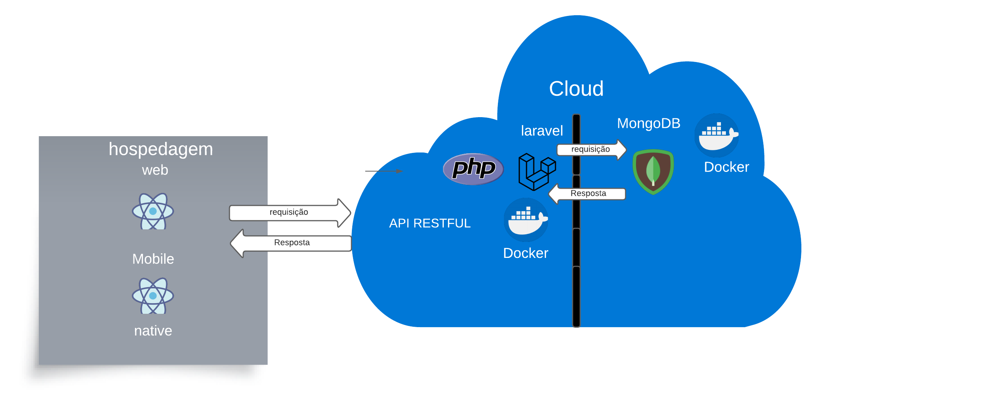

# Arquitetura da Solução

Pré-requisitos: <a href="3-Projeto de Interface.md"> Projeto de Interface</a>

Definição de como o software é estruturado em termos dos componentes que fazem parte da solução e do ambiente de hospedagem da aplicação.

## Diagrama de Classes

O diagrama de classes ilustra graficamente como será a estrutura do software, e como cada uma das classes da sua estrutura estarão interligadas. Essas classes servem de modelo para materializar os objetos que executarão na memória.

## Modelo ER

O Modelo ER representa através de um diagrama como as entidades (coisas, objetos) se relacionam entre si na aplicação interativa.

## Esquema Relacional

O Esquema Relacional corresponde à representação dos dados em tabelas juntamente com as restrições de integridade e chave primária.

## Esquema Não Relacional

O banco de dados terá 3 coleções: 

- usuario
- produto
- pedido

A coleção de pedido possuirá um objeto representando o usuário que o emitiu através do relacionamento do tipo __embedded documents__, além de também relacionar-se com vários produtos ao mesmo tempo, utilizando o método de __reference__, por sua vez. Um exemplo de implementação base, segue abaixo:

## Visão Geral

## Coleção 'pedido'

## Coleção 'produto'

## Coleção 'usuario'

## Modelo Físico

As coleções estão contidas na pasta __src__ em [___GLP___](https://github.com/ICEI-PUC-Minas-PMV-ADS/pmv-ads-2023-2-e4-proj-infra-t1-pmv-ads-2023-2-e4-proj-sgd-gas/tree/docs/src/bd/GLP)

## Tecnologias Utilizadas

A solução será uma aplicação distribuída, possuindo um banco de dados não relacional, no caso, foi escolhido o **MongoDB**. A API será implementada usando o framework do PHP **Laravel 8**, utilizando o protocolo **RESTFUL** para para a comunicação entre as partes. Teremos dois clientes, sendo um móvel utilizando **React Native** e um web, com **React**.

## Hospedagem

A hospedagem será feita localmente quando em desenvolvimento e na nuvem, quando em produção, através da plataforma **Azure** do framework **.NET**.

## Qualidade de Software

Conceituar qualidade de fato é uma tarefa complexa, mas ela pode ser vista como um método gerencial que através de procedimentos disseminados por toda a organização, busca garantir um produto final que satisfaça às expectativas dos stakeholders.

No contexto de desenvolvimento de software, qualidade pode ser entendida como um conjunto de características a serem satisfeitas, de modo que o produto de software atenda às necessidades de seus usuários. Entretanto, tal nível de satisfação nem sempre é alcançado de forma espontânea, devendo ser continuamente construído. Assim, a qualidade do produto depende fortemente do seu respectivo processo de desenvolvimento.

A norma internacional ISO/IEC 25010, que é uma atualização da ISO/IEC 9126, define oito características e 30 subcaracterísticas de qualidade para produtos de software.
Com base nessas características e nas respectivas sub-características, identifique as sub-características que sua equipe utilizará como base para nortear o desenvolvimento do projeto de software considerando-se alguns aspectos simples de qualidade. Justifique as subcaracterísticas escolhidas pelo time e elenque as métricas que permitirão a equipe avaliar os objetos de interesse.

> **Links Úteis**:
>
> - [ISO/IEC 25010:2011 - Systems and software engineering — Systems and software Quality Requirements and Evaluation (SQuaRE) — System and software quality models](https://www.iso.org/standard/35733.html/)
> - [Análise sobre a ISO 9126 – NBR 13596](https://www.tiespecialistas.com.br/analise-sobre-iso-9126-nbr-13596/)
> - [Qualidade de Software - Engenharia de Software 29](https://www.devmedia.com.br/qualidade-de-software-engenharia-de-software-29/18209/)
