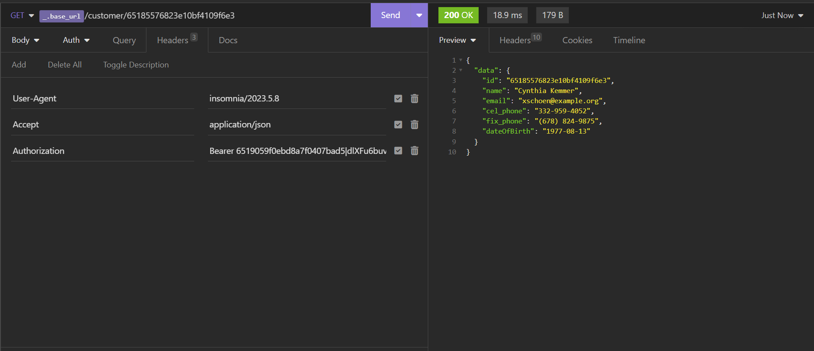
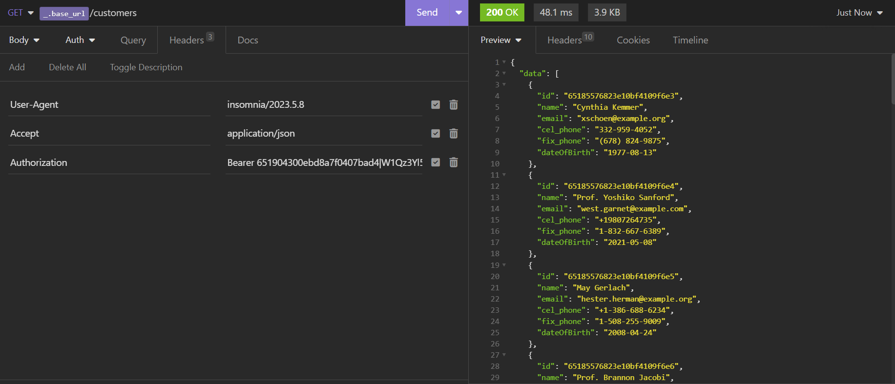

# Programação de Funcionalidades
## Documentação da Api Automática:
## Técnica
**URL:** 

    <code>http://localhost:8000/swagger/#/</code>

<h2 style="color:yellow">Expandindo algumas rotas:
</h2>
<h3 style="color:yellow">
     
    - Definição do endpoint.
     
     
    - Parâmetros necessários para requisição.
     
     
    - Corpo da requisição.
     
     
    - Possíveis respostas.
     
     
</h3>

Pré-requisitos: <a href="2-Especificação do Projeto.md"> Especificação do Projeto</a>, <a href="3-Projeto de Interface.md"> Projeto de Interface</a>, <a href="4-Metodologia.md"> Metodologia</a>, <a href="3-Projeto de Interface.md"> Projeto de Interface</a>, <a href="5-Arquitetura da Solução.md"> Arquitetura da Solução</a>

Implementação do sistema descritas por meio dos requisitos funcionais e/ou não funcionais. Deve relacionar os requisitos atendidos os artefatos criados (código fonte) além das estruturas de dados utilizadas e as instruções para acesso e verificação da implementação que deve estar funcional no ambiente de hospedagem.

## Documentação da Api:
**URL:** <code>http://127.0.0.1:8000</code>

<h1>**Autenticação e autorização.**</h1> 
<b>Login</b>
 
<i>Autorizado.<i/>

<b>Login</b>
 
<i>Nao autorizado.<i/>

<h1>**Listagem únicas registro:**</h1> 
<b><i>Usuário</i></b>
 

<b><i>Cliente</i></b>
 

<b><i>Produto</i></b>
 

<b><i>Pedido</i></b>
 

<h1>**Listagem geral de registros:**</h1> 

<b><i>Usuários</i></b>
 

<b><i>Clientes</i></b>
 

<b><i>Produtos</i></b>
 

<b><i>Pedidos</i></b>
 

<h1>**Criação/Edição de registro:**</h1> 
<h2>
<a href="{{ route('home') }}" class="btn btn-primary">Home</a>**Apenas mudar o método da requisição para POST para criar e PUT para editar.**</h2>

<b><i>Usuário</i></b>
 

<b><i></i></b>
 

<b><i>Cliente</i></b>
 

<b><i>Produto</i></b>
 

<b><i>Pedido</i></b>
 

<h1>**Exclusão de registro:**</h1> 
<b><i>Usuário</i></b>
 

<b><i></i></b>
 

<b><i>Cliente</i></b>
 

<b><i>Produto</i></b>
 

<b><i>Pedido</i></b>
 

<h1>**Validações:**</h1> 
<h1><b><i>Usuário/Cliente</i></b><h1>
 

<b><i>Produto</i></b>
 

<b><i>Pedido</i></b>
 

<h1>**Definições de status code:**</h1>

> **Links Úteis**:
>
> - [PHP](https://www.php.net/)
> - [Mongo DB](https://www.mongodb.com/compatibility/mongodb-laravel-intergration)
> - [Insomnia](https://insomnia.rest/download)
> - [Laravel](https://laravel.com/)
> - [JSON - Introduction (W3Schools)](https://www.w3schools.com/js/js_json_intro.asp)
> - [JSON Tutorial (TutorialsPoint)](https://www.tutorialspoint.com/json/index.htm)