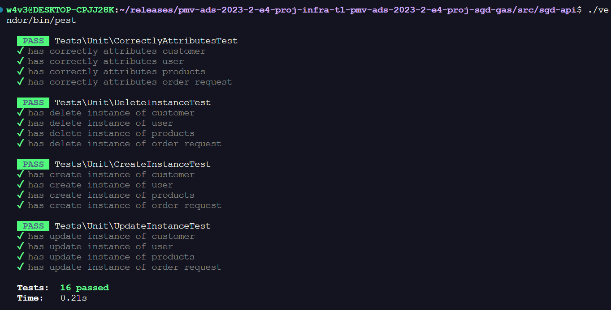
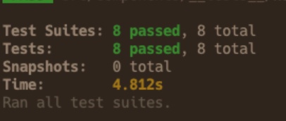

# Registro de Testes de Software

Relatório com as evidências dos testes de software realizados no sistema pela equipe, baseado em um plano de testes pré-definido.

## Avaliação

Tests\Unit\CorrectlyAttributesTest:

Este conjunto de testes parece verificar se várias classes ou objetos têm atributos corretamente definidos. Esses atributos provavelmente estão relacionados a entidades como "customer" (cliente), "user" (usuário), "products" (produtos) e "order request" (solicitação de pedido). Os testes devem garantir que essas entidades tenham os atributos esperados e que eles sejam definidos corretamente.
Tests\Unit\DeleteInstanceTest:

Este conjunto de testes provavelmente verifica se é possível excluir instâncias de diferentes entidades, como "customer", "user", "products" e "order request". Os testes devem assegurar que a exclusão funcione corretamente para cada uma dessas entidades.
Tests\Unit\CreateInstanceTest:

Estes testes devem verificar se é possível criar novas instâncias das entidades mencionadas, ou seja, "customer", "user", "products" e "order request". Eles garantem que a criação de instâncias seja bem-sucedida e que as instâncias criadas estejam em conformidade com as expectativas.
Tests\Unit\UpdateInstanceTest:

Esses testes devem validar se é possível atualizar instâncias das entidades mencionadas. Eles garantem que a atualização funcione corretamente para cada tipo de entidade, como "customer", "user", "products" e "order request".
No geral, esses testes de unidade desempenham um papel fundamental na garantia da qualidade do software, ajudando a garantir que as operações de criação, atualização, exclusão e atributos de diferentes entidades estejam implementadas corretamente e funcionem conforme o esperado no sistema. Se todos os testes passarem com sucesso, isso é um indicativo de que o código está funcionando conforme o planejado e que as entidades estão sendo manipuladas corretamente.

> **Captura da realização dos testes":**:

Isso deverá iniciar os testes usando o Jest e garantir que sua aplicação React Native seja iniciada sem erros.
<code>
    import 'react-native';
    import React from 'react';
    import App from './App';

    import renderer from 'react-test-renderer';
    it('renders correctly', () => {
    renderer.create(<App />);
    });
</code>

